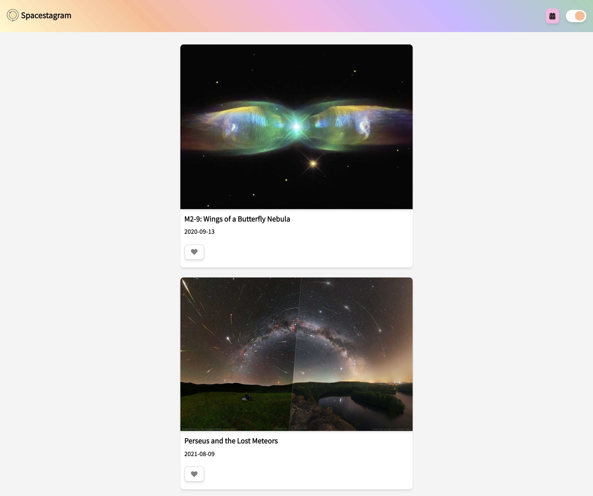
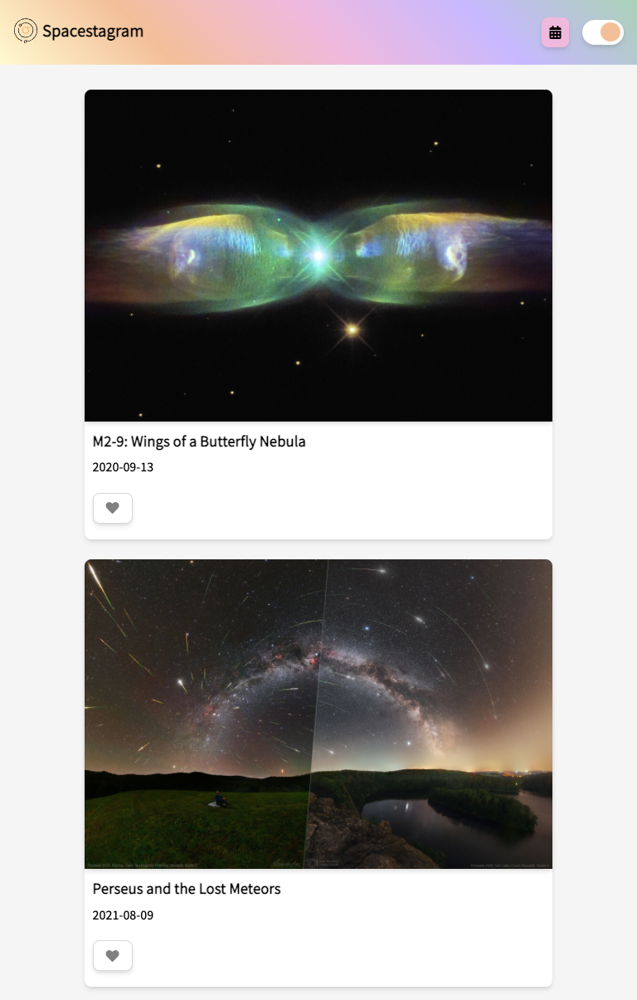
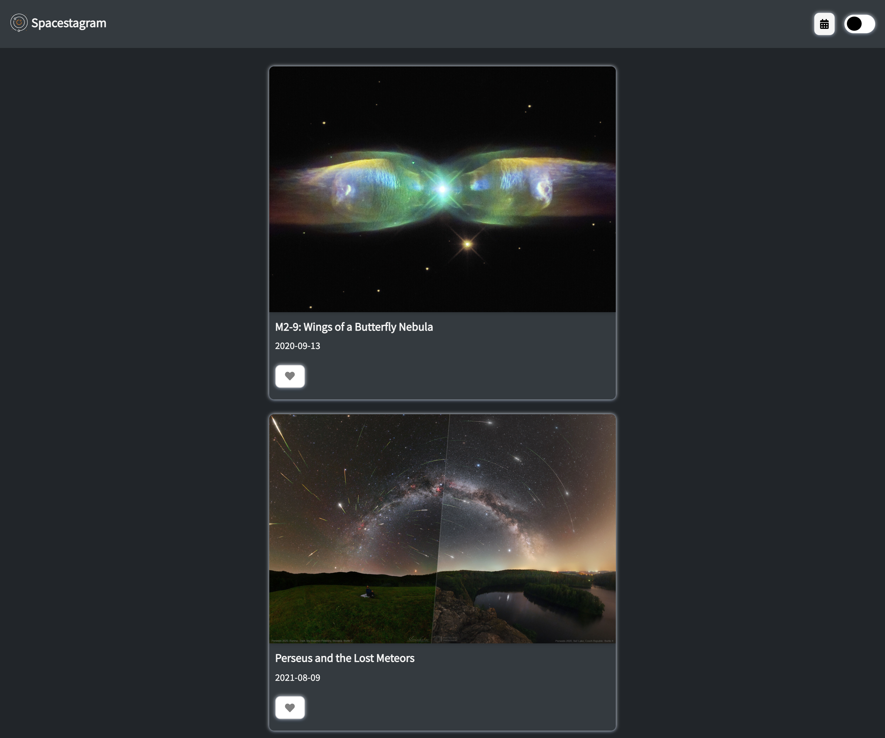
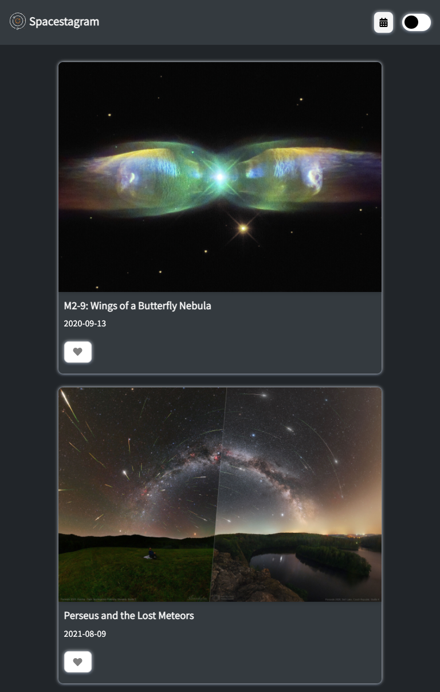
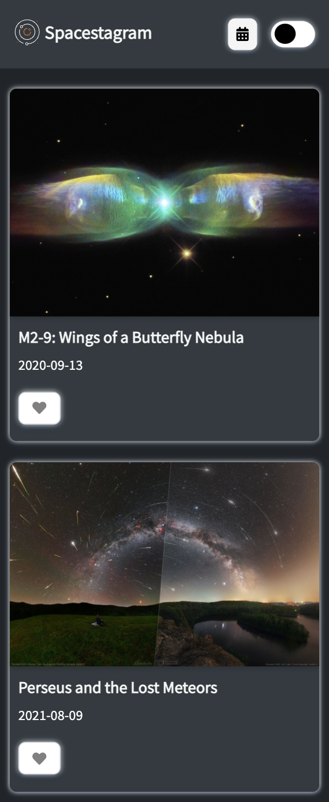

# Spacestagram

It's an app that gets images from [NASA'S Astronomy Picture Of The Day (APOD) API](https://api.nasa.gov/).

## Table of contents

- [The challenge](#the-challenge)
- [Features](#features)
- [Technologies](#built-with)
- [Live](#live)
- [Screenshot](#screenshot)
- [Author](#author)

## Overview

### The Challenge
- Fetch data from one of NASA’s APIs and display the resulting images
- Display descriptive data for each image (for example: title, date, description, etc.)
- Like an image
- Unlike an image

### Features
- User can like or dislike an image
- User can toggle to dark light mode
- Loading page shows as site is fetching data
- Display 10 random images
- User can search an image by specific date
- Responsive design

### Technologies
- Semantic HTML5 markup
- CSS custom properties
- Flexbox
- JavaScript
- NASA API

### Live
- [Spacestagram](https://aramatsolrac.github.io/spacestagram/)

### Screenshots

Light Mode

<!-- ##### Desktop

##### Tablet

##### Mobile
 -->

Dark Mode

##### Desktop
<!-- 

##### Tablet

##### Mobile
 -->

### Author

- Linkedin - [Tamara Carlos](https://www.linkedin.com/in/tamaracarlos/)
- Twitter - [@aramatsolrac](https://twitter.com/aramatsolrac)

