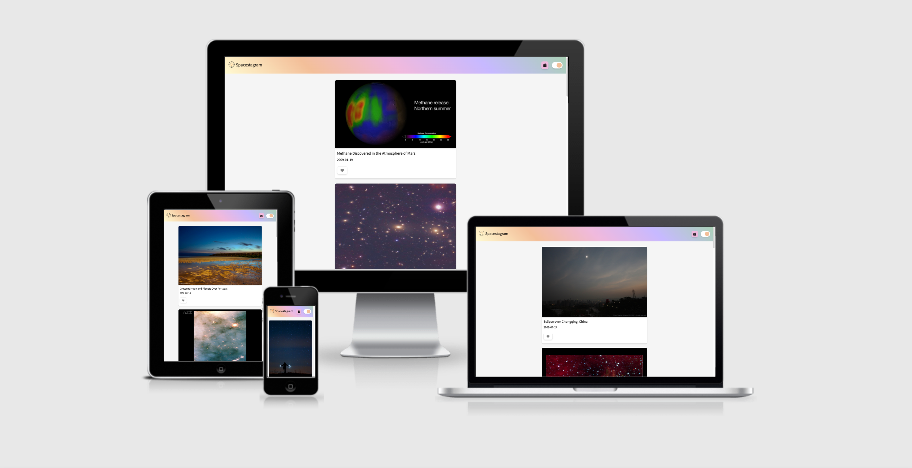
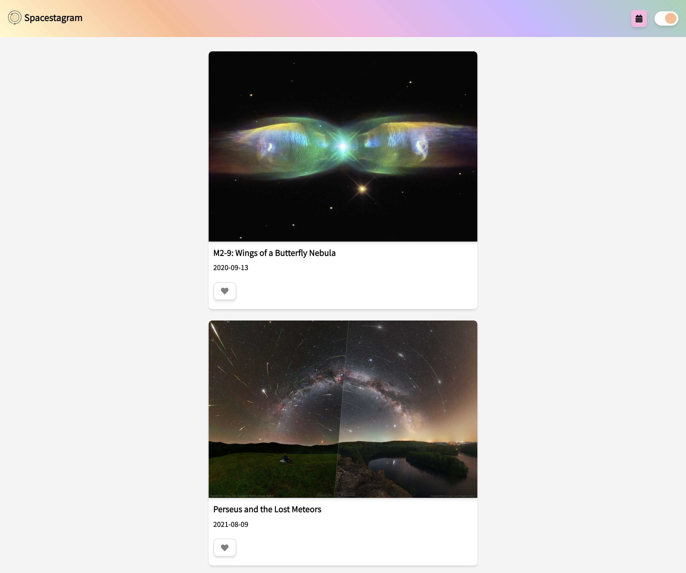
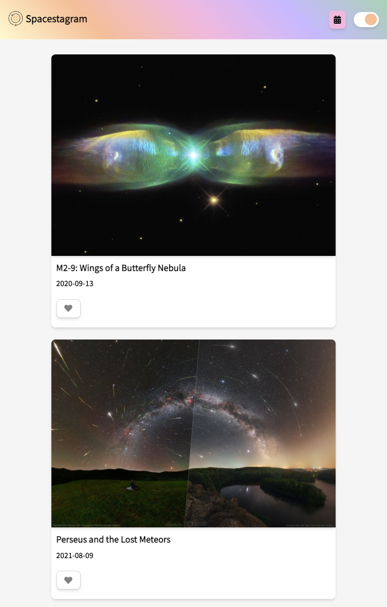
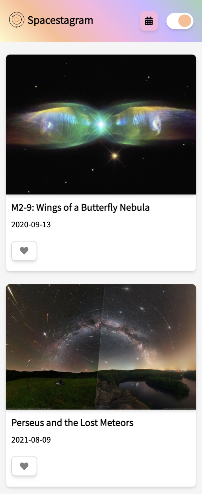
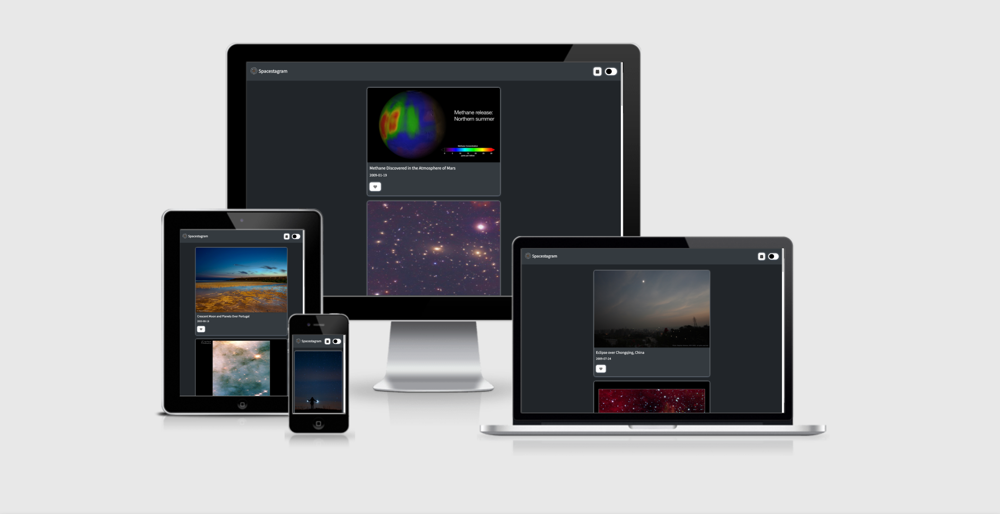
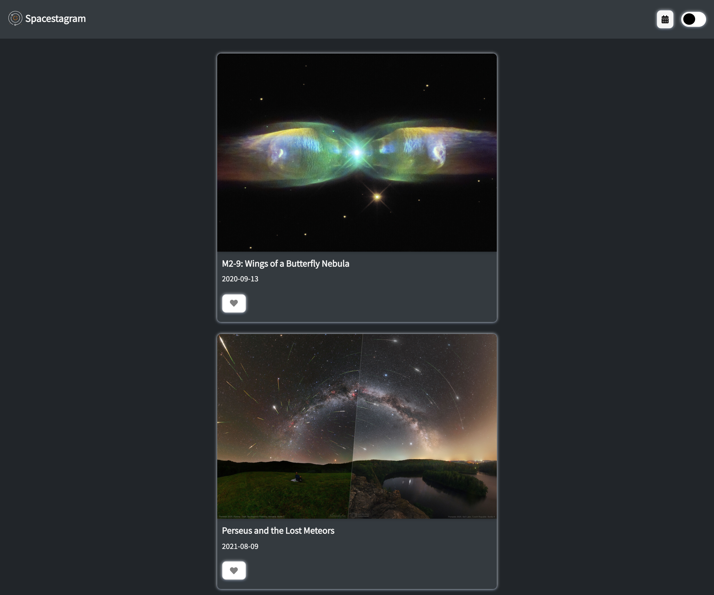
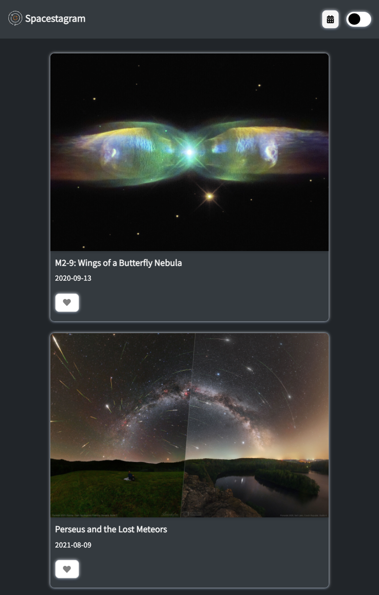
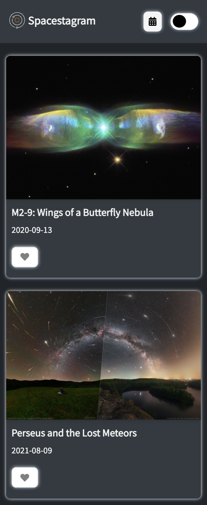

# Spacestagram

It's an app that gets images from [NASA'S Astronomy Picture Of The Day (APOD)](https://api.nasa.gov/#apod) API.

## Table of contents

- [The challenge](#the-challenge)
- [Features](#features)
- [Technologies](#technologies)
- [Installing](#installing)
- [Live](#live)
- [Screenshots](#screenshots)
- [Author](#author)

## Overview

### The Challenge

- Fetch data from one of NASA’s APIs and display the resulting images
- Display descriptive data for each image (for example: title, date, description, etc.)
- Like an image
- Unlike an image

### Features

- User can like or dislike an image
- User can toggle to the dark or light mode
- Loading page shows as the site is fetching data
- Display 10 random images
- User can search an image by a specific date
- Responsive design

### Technologies

- Semantic HTML5 markup
- CSS custom properties
- Flexbox
- JavaScript
- NASA API

### Installing

- Download the Repository
- Open `index.html` on a web browser (*Best support on Google Chrome*)

### Live

- <a href="https://aramatsolrac.github.io/spacestagram/" target="_blank">Spacestagram</a>

### Screenshots

Light Mode

#### Responsive

##### Desktop

##### Tablet

##### Mobile

Dark Mode

#### Responsive

##### Desktop

##### Tablet

##### Mobile

### Author

- Linkedin - [Tamara Carlos](https://www.linkedin.com/in/tamaracarlos/)
- Twitter - [@aramatsolrac](https://twitter.com/aramatsolrac)

---

